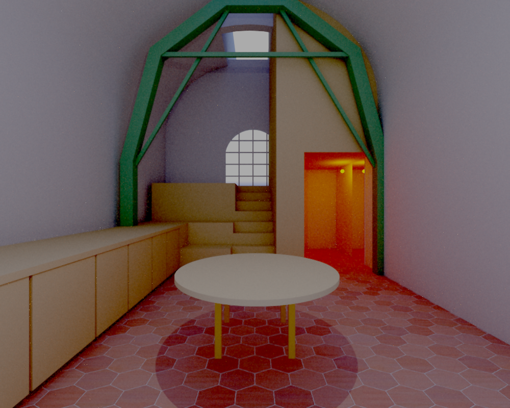
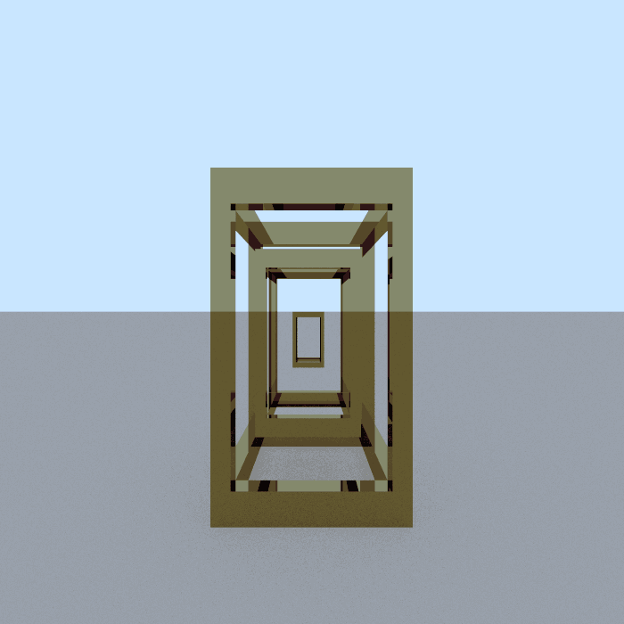
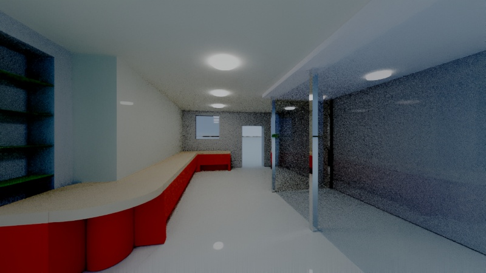

# RayTracer

A high-performance, object-oriented CPU path tracer with BVH8 acceleration, SIMD-optimized AABB traversal, and flexible scene configuration.
A 1 month Epitech University project with a bit more polish.

[](./docs/index.html)

<p align="center">
  
  
</p>

<p align="center">
  
</p>


## Usage

```bash
./raytracer <scene.cfg> [options] > output.ppm
```

**Options:**
- `-t N`     Spawn N threads for parallel rendering (default: 1)
- `-p`      Show progress bar and performance metrics
- `-f`      Enable full Bi-Directional Path Tracing (BDPT); paradoxically, faster than normal Unidirectional Path Tracing (UDPT).
- `-spp N`  Samples per pixel (default: 32)
- `-md N`   Max ray-bounce depth (default: 16)
- `-viz mode` Open SFML window to visualize rendering; modes: scanline, tiles, random
- `-d`      Enable debug output

**Example:**
```bash
./raytracer assets/scenes/house.cfg -f -t 8 -p -spp 64 > render.ppm
```

## Features
  
  ### Core Primitives
  - Sphere, Plane
  
  ### Mesh & Import
  - Triangle, OBJ/STL support
  
  ### Additional Primitives
  - Box, Cylinder, Cone, Torus, Menger Sponge, TangleCube, Sierpinski
  
  ### Transformations
  - Translation, Rotation, Scale, Shear
  
  ### Materials & Textures
  - Flat colors, Image/PPM textures, Checker & Noise maps
  
  ### Lighting & Shading
  - Ambient, Directional, Point lights; Shadow shading, Phong & BDPT path tracing
  
  ### Performance
  - BVH8 acceleration, SIMD AABB, AVX2, OpenMP multithreading
  
  ### Interface
  - CLI output to PPM, optional SFML preview, progress bar

## Utilities

### rotation_gif

A helper script that automates rendering and animating a 360° spin around a static scene.

- **What it does**
  1. Reads your scene (without any `camera` block) from `scripts/scene_static.cfg`.
  2. Generates 60 camera positions on a circle of radius 10.0 around the point (0.0, 3.0, 0.0).
  3. Renders each frame with 32 threads via `./raytracer`, saving intermediate PPMs in `scripts/frames/`.
  4. Converts frames to PNG and stitches them into `output.gif`.
  5. Cleans up temporary files.

- **Prerequisites**
  - Python 3
  - Python Pillow package
  ```bash pip install pillow```

- **Usage**
  ```bash
  # Ensure your static scene config (no camera block) is at:
  #   scripts/scene_static.cfg
  python3 scripts/rotation_gif.py

## ⚙️ Tech Stack

**Languages:**
- C++17 (standard library only)
- Python 3 (utility scripts)

**Concurrency & Performance:**
- OpenMP (CPU multithreading)
- AVX2 intrinsics (`<immintrin.h>`) for SIMD
- Manual BVH8 layout & traversal optimization

**File Handling & Parsing:**
- Custom STL (binary/ASCII) parser
- `libconfig++` for scene configuration

**Visualization & Scripting:**
- SFML for real-time preview
- Pillow (Python) for frame conversion and GIF generation
- (Optional) `ffmpeg` for video encoding

**No external rendering engines, no physics libraries, no model loaders.**  

## 📚 Documentation

Full Doxygen-generated documentation is available here:  
[Open Docs](https://pcyrian.github.io/AdvancedRaytracer/)

Includes detailed breakdowns of classes, rendering pipeline internals, BVH traversal logic, and SIMD functions.


## 🧾 Attribution

This project originated as a university assignment at EPITECH in early 2025.  
While initially hosted in a team repo, **over 90% of the implementation, design, and feature development was authored independently by me (Cyrian Pittaluga)**.  
This public version is a **fully standalone, solo rewrite** with expanded features, rewritten logic, and personal polish.

### 📄 License

This codebase is released under the **MIT License**.  
You are free to use, modify, and distribute it—just keep the original author credited.

For the assets and example scenes:
- **STL models** and **config files** created by me are also MIT unless stated otherwise.
- If any 3rd-party files are added in the future, they’ll be explicitly marked in `/assets/third_party`.
